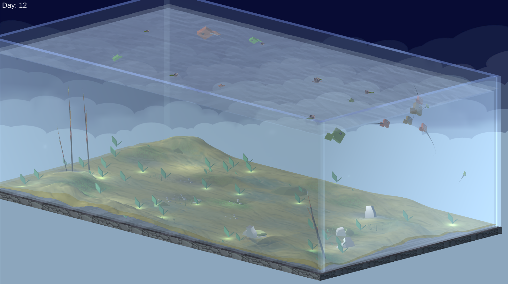
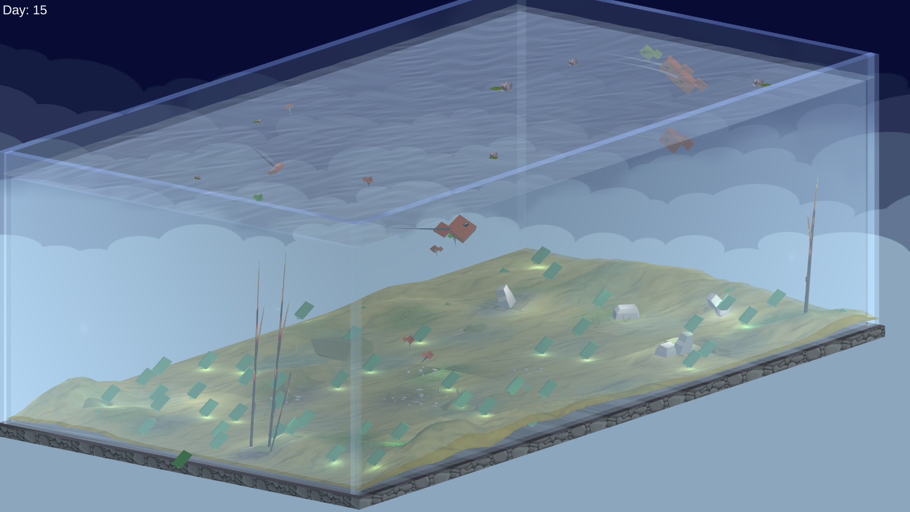

# Marine Ecosystem Simulation

A simple hierarchy-based marine ecosystem developed in Unity for my Environmental Science class in college.

**Screenshots:**

## Mechanics

### Hierarchy 

### Spawning

### Procedural Animation

